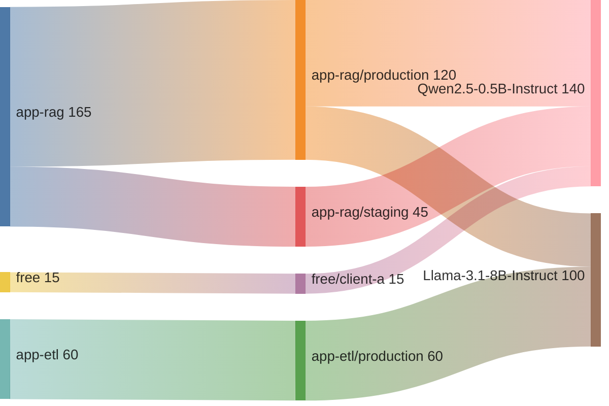

# MLOps

A curated collection of hands-on guides, tutorials, and reference implementations for **Machine Learning Operations (MLOps)** — covering topics like observability, model deployment, monitoring, automation, scalable architecture, AI Governance and scalable infrastructure.

Whether you're an **MLOps engineer**, **data scientist**, or **AI enthusiast**, this repo is designed to help you build, ship, and manage ML systems in production.

## Table of Content

* **vLLM**
  * [vLLM overview](vLLM)
  * [vLLM observability](vLLM/observability)

# Example Sankey Diagram about app -> api-key -> model Observability

## Author

Created by [Himadri Talukder](https://www.linkedin.com/in/himadri-talukder-214b2539/)
If you find this helpful, please ⭐ the repo and share it with your MLOps community!
